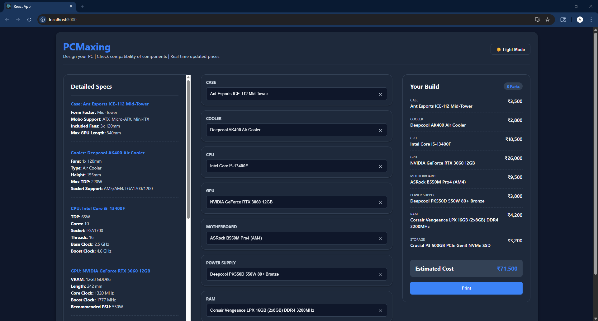
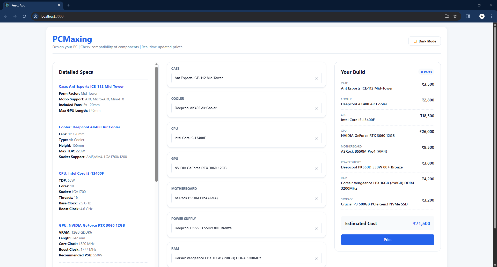

#PCMaxing.com
##PC Design web app with real time pricing and component compability checks.
##Built with Express.js, React.js, Typescript, MySQL. Deployed using AWS. Other tools used: Git, Kubernets, Docker, Jetbrains Datagrip

PCMaxing a web app to help you design your own custom computer. Select components easily using the active search boxes with quick suggesstions. Latest pricing and current tally is updated instantly using latest data cached in the MySQL Database. Component Compatibility checks ensure that the selected components are compatible with each other. Smooth and interactive UI with dark mode further enhances the user experience. Print functionality allows to print the data in current instance as a invoice

Screenshots:

##NOTE: This project was intitially deployed using AWS Trial which has expired. It is currently unavailable online until feasible deployment methods are found. Instructions for local deployment given below.
1. Ensure MySQL, Node, npm and compatible browser are installed.  
2. Setup database using setupDB.sql script. 
3. Open terminal into PCMaxing folder. 
4. Run cd .\backend node server.js
5. Open new terminal. Run cd .\frontend npm start